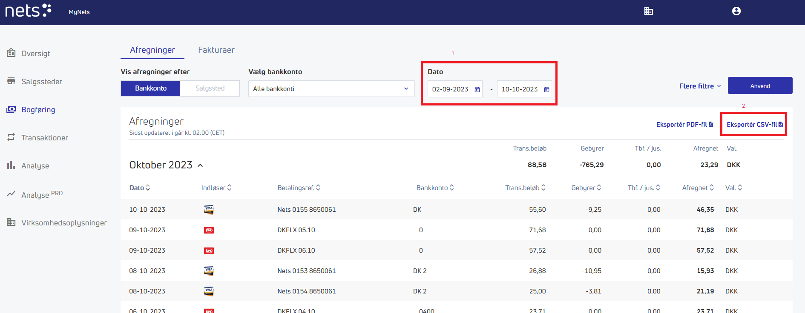
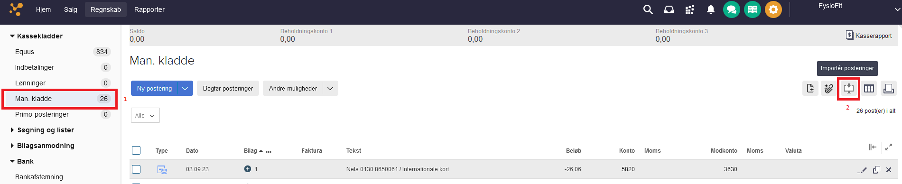
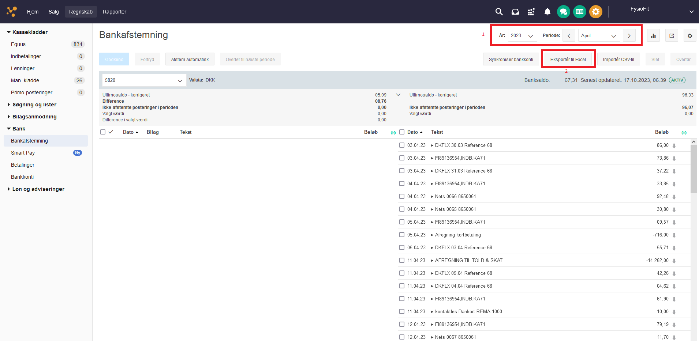

# FysioFit Jelling - Regnskabshjælp

## Målet
Målet er at få afstemt poster i regnskabet med udgangspunkt i bankkonto-udtog vha. af oprette manglende posteringer i E-conomic.

## Processen
Inde i E-conomic Bankafstemning er alle posteringer som der skal afstemmes. Denne liste indeholder Equus transaktioner(Kunde betalinger i forskellige grader) samt andre finansielle transaktioner (Rengøring, Husleje osv.)
Der er altid mange Equus transaktioner (4 behandlere * hvor mange patentier I nu har). For at gøre opgaven så let som overhovedet mulig, fokuseres der ikke på disse. De stemmer og skal kun bankafstemmes. Der er dog nogle gebyrer ifb. kortbetaling (Hovedsageligt Mastercard/visa). Disse skal importeres og behandles.
Det sker [Nets-fil](#nets-fil) hvor transaktioner hentes ned, og der laves posteringer for gebyrer.

Det næste punkt er indtastning af transaktioner der ikke tilhører Equus. Disse skal importeres og behandles. Det sker i [E-conomic bankafstemning](#e-conomic-bankafstemning).

**Bemærk at Nets fil og E-conomic bankafstemning kan have overlap i bilagsnr. Derfor skal disse behandles separat. Enten via separate kladder eller 2 bogføringer.**

Nu skal der tastes kontonumre/fordeling på de enkelte linjer, således at linjerne stemmer.

### Nets-fil
#### Download fil
Downloades herfra: https://my.nets.eu/portal/dashboard  
Under "Bogføring", sættes dato perioden og herefter trykkes der "Eksportér CSV-Fil"

#### Behandl fil
1. Vælg CSV-filen du netop har downloadet
2. Vælg hvor den nye fil skal gemmes

Teknisk beskrivelse: Filen importeres, finder området som er aktuelt for os, sorteres i stigende orden og der laves posteringer på de tal hvor der er gebyrer på.

#### Importér fil igen

### E-conomic bankafstemning
#### Download fil
Downloades herfra: https://secure.e-conomic.com/accounting/bank/reconciliation  
Under "Bankafstemning", vælges perioden og herefter "Eksportér til Excel"

#### Behandl fil
1. Vælg Excel-filen du netop har downloadet
2. Vælg hvor den nye fil skal gemmes

Teknisk beskrivelse: Filen importeres, finder området som er aktuelt for os, sorteres i stigende orden og der lavet posteringer hvor de ikke matcher følgende:
* `DKFLX*` - Dette er dankort indbetalinger
* `FI89136954,INDB.KA71` - Dette er FI-indbetalinger (Girokort)
* `Nets * 8650061` - Dette er Mastercard/Visa

#### Importér fil igen
